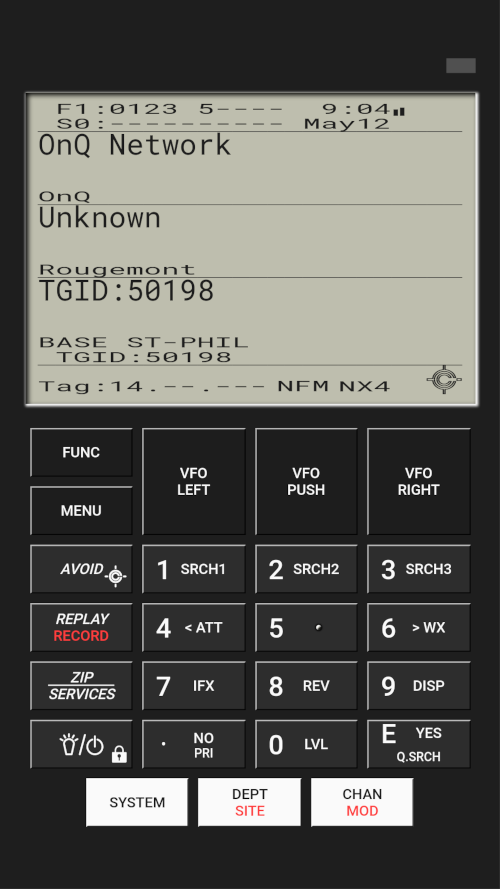

# RC Scanner (BETA)

*RC Scanner*, or Remote Controlled Scanner, is a progressive web interface which allows you to remotely control your scanner and receive audio from anywhere in the world. *RC Scanner* is degined to works well on desktop and mobile devices.

Need help?

[](https://gitter.im/rc-scanner/Lobby?utm_source=share-link&utm_medium=link&utm_campaign=share-link)


## Supported models

At the moment, *RC Scanner* only works with a limited number of radio scanners.

Supported models:

* Uniden BCD436HP (stable)
* Uniden BCD396T (stable)

Other scanner models can be added on request as long as I can get one. Any lease or donation of such a scanner model is welcome.

## Supported platforms

Since *RC Scanner* uses libraries [Node SerialPort](https://serialport.io/) and [Naudiodon](https://github.com/Streampunk/naudiodon), which are both multiplatform, there should'nt be to much trouble running it on other platforms. If you do try *RC Scanner*, please share you experience on [Gitter](https://gitter.im/rc-scanner/Lobby?utm_source=share-link&utm_medium=link&utm_campaign=share-link)

## Features

* Remote control your radio scanner with very low latency (you can even get audio feedback)

* Care has been taken to minimize data transfer to the client application

  * Screen updates suspended while application isn't focused
  * Audio stream suspended if no audio output on the scanner (squelch adjustable)

## Screenshot (BCD436HP)



## Quick start

It is fairly easy to have *RC Scanner* up and running.

Ensure that your operating system is fully updated and that the prerequisites are installed:

* [Git](https://git-scm.com/downloads)
* [Node.js LTS or higher](https://nodejs.org/en/download/)
* [npm](https://www.npmjs.com/get-npm)
* [python](https://www.python.org/downloads/)
* openssl

Then clone the *RC Scanner* code and run it:

```bash
$ git clone https://github.com/chuot/rc-scanner.git
Cloning into 'rc-scanner'...
remote: Enumerating objects: 3821, done.
remote: Counting objects: 100% (3821/3821), done.
remote: Compressing objects: 100% (2975/2975), done.
Receiving objects: 100% (3821/3821), 6.87 MiB | 10.65 MiB/s, done.
remote: Total 3821 (delta 1693), reused 2156 (delta 662)
Resolving deltas: 100% (1693/1693), done.

$ cd rc-scanner

$ Installing node modules... done
Building client app... done
Server is running at http://0.0.0.0:3000
Connected to /dev/ttyUSB0
```

Note that the first time you start *RC Scanner*, it will be longer to do so as it has to install required node modules and build the progressive web app.

A default configuration file `rc-scanner/server/.env` will be created.

At this point, you should review the configuration file to ensure that it is conform to your setup.

When done, re-run again `node run.js` to launch the application.

