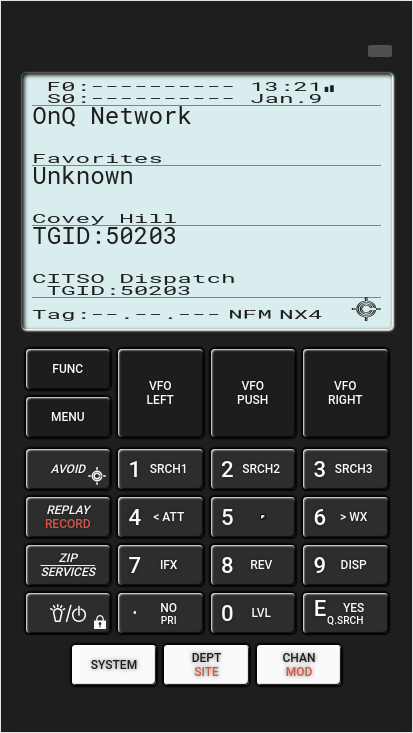

# RC Scanner (BETA)

*RC Scanner*, or Remote Controlled Scanner, is a progressive web interface which allows you to remotely control your scanner and receive audio from anywhere in the world. *RC Scanner* is degined to works well on desktop and mobile devices.

Need help?

[](https://gitter.im/rc-scanner/Lobby?utm_source=share-link&utm_medium=link&utm_campaign=share-link)


## Supported models

At the moment, *RC Scanner* only works with a limited number of radio scanners.

Supported models:

* Uniden BCD436HP (stable)
* Uniden BCD396T (future development; already have one in hand)

It is in the plans to add support for other radio scanner models, but first I have to find a way to get my hands on these models as they are generally quite expensive. Any help on the subject would be greatly appreciated.

Therefore, support for other radio scanner models will be added upon request and based on feasibility (as noted above).

## Supported platforms

*RC Scanner* is being developed and tested on [Fedora Workstation](https://getfedora.org/en/workstation/) and runs in production on [Debian](https://www.debian.org/).

Since *RC Scanner* uses libraries [Node SerialPort](https://serialport.io/) and [Naudiodon](https://github.com/Streampunk/naudiodon), which are both multiplatform, there should'nt be to much trouble running it on other platforms. If you do try *RC Scanner*, please share you experience on [Gitter](https://gitter.im/rc-scanner/Lobby?utm_source=share-link&utm_medium=link&utm_campaign=share-link)

## Features

* Remote control your radio scanner with very low latency (you can even get audio feedback)

* Care has been taken to minimize data transfer to the client application

  * Screen updates suspended while application isn't focused
  * Audio stream suspended if no audio output on the scanner (squelch adjustable)

## Screenshot (BCD436HP)



## Keyboard shortcuts

You can control your scanner by clicking buttons, or by using keyboard shorcuts.

Here's the list of keyboard shorcuts (BCD4336HP):

|       |       |       |       |
| :---: | :---: | :---: | :---: |
| FUNC (**F**) | VFO LEFT | VFO PUSH | VFO RIGHT|
| MENU (**M**) | (**Left arrow**) | (**Space**) | (**Right arrow**) |
| AVOID/CC (**A**) | 1/SRCH1 (**1**) | 2/SRCH2 (**2**) | 3/SRCH3 (**3**) |
| REPLAY/RECORD (**R**) | 4/</ATT (**4**) | 5 (**5**) | 6/>/WX (**6**) |
| ZIP/SERVICE (**Z**) | 7/IFX (**7**) | 8/REV (**8**) | 9/DISP (**9**) |
| LIGHT/POWER/LOCK (**L**) | ./NO/PRI (**.**) | 0/LVL (**0**) | E/YES/Q.SRCH (**Enter**) |

|       |       |       |
| :---: | :---: | :---: |
| SYSTEM (**S**) | DEPT/SITE (**D**) | CHAN/MOD (**H**) |

You can also **toggle fullscreen** display by either double clicking/taping on the display area, or either by pressing the **Tab key**.

## Ground loop effect

It appears that some scanner, while they are connected to the USB port **and** the audio port at the same time will produce a poor audio feed. This is mainly due to a [ground loop effect](https://en.wikipedia.org/wiki/Ground_loop_(electricity)).

To solve this issue, just insert on your audio cable a ground loop noise isolator. I use with success the AUKEY Ground Loop Noise Isolator, which you can grab at Amazon for about 15$.

## Quick start

It is fairly easy to have *RC Scanner* up and running.

Ensure that your operating system is fully updated and that the prerequisites are installed:

* [Git v2.23.0 or higher](https://git-scm.com/downloads)
* [Node.js v10.9.0 or higher](https://nodejs.org/en/download/)
* [npm v6.2.0 or higher](https://www.npmjs.com/get-npm)

Then clone the *RC Scanner* code and run it:

```bash
$ git clone https://github.com/chuot/rc-scanner.git
Cloning into 'rc-scanner'...
remote: Enumerating objects: 3821, done.
remote: Counting objects: 100% (3821/3821), done.
remote: Compressing objects: 100% (2975/2975), done.
Receiving objects: 100% (3821/3821), 6.87 MiB | 10.65 MiB/s, done.
remote: Total 3821 (delta 1693), reused 2156 (delta 662)
Resolving deltas: 100% (1693/1693), done.

$ cd rc-scanner

$ node run.js
Installing node modules... done
Building client app... done

Please select one of the following scanner model:

(1) bcd436hp

Enter model: 1

Default configuration created at /home/chuot/Git/rc-scanner/server/.env.

Please review them, then re-run the application.

NODE_ENV=production
NODE_HOST=0.0.0.0
NODE_PORT=3000

RC_MODEL=bcd436hp
RC_HIDE_SERIAL_NUMBER=false

RC_AUDIO_DEVICE_ID=-1
RC_AUDIO_SAMPLE_RATE=44100
RC_AUDIO_SQUELCH=100

RC_COM_BAUDRATE=115200
RC_COM_DATABITS=8
RC_COM_PARITY=none
RC_COM_PORT=/dev/ttyACM0
RC_COM_RTSCTS=false
RC_COM_STOPBITS=1

$ node run.js
Remote Controlled Scanner is running at http://0.0.0.0:3000/
Connected to /dev/ttyACM0
...
PortAudio V19.6.0-devel, revision unknown
Input audio options: default device, sample rate 44100, channels 1, bits per sample 16, max queue 2, close on error false
Input device name is default
```

Note that the first time you start *RC Scanner*, it will be longer to do so as it has to install required node modules and build the progressive web app.

A default configuration file `rc-scanner/server/.env` will be created.

At this point, you should review the configuration file to ensure that it is conform to your setup.

When done, re-run again `node run.js` to launch the application.

## Configuration file

*RC Scanner* configuration file is located at `rc-scanner/server/.env`.

You can setup the following variables to suit your needs:

```bash
#
# NODE related configuration
#
NODE_ENV=production
NODE_HOST=0.0.0.0
NODE_PORT=3000

#
# RC Scanner base parameters
#

# Specify one of the supported models

RC_MODEL=

# Some radio scanners display their serial number.
# Here you can choose not to display the serial number
# (replaced by zeros) on the client side

RC_HIDE_SERIAL_NUMBER=false

#
# RC Scanner audio related parameters
#

# Which audio device to use. # -1 is for default device
# You can get a list of your audio device with the
# following command: 'npm run list-audio'

RC_AUDIO_DEVICE_ID=-1

# The sampling rate that match your audio device

RC_AUDIO_SAMPLE_RATE=44100

# PCM squelch value.
# Below that value, server won't send audio data to client
# Value of 0 will disable this feature.
# You should try a value between 0 and 5000. It all depends
# if you do have ground loop noises or not.

RC_AUDIO_SQUELCH=100

#
# RC Scanner serial port related parameters
#

RC_COM_BAUDRATE=115200
RC_COM_DATABITS=8
RC_COM_PARITY=none
RC_COM_PORT=/dev/ttyACM0 on Linux/Unix or com1 on Windows
RC_COM_RTSCTS=false
RC_COM_STOPBITS=1
```

There is also some advanced parameters that you shouldn't have to change:

```bash
#
# RC Scanner advanced parameters
#

# Reconnect after this amount of milliseconds to the audio
# device if the naudiodon library has crashed.
RC_AUDIO_RECONNECT_INTERVAL=5000

# Retry to connect to serial port after this amount of milliseconds.

RC_COM_RECONNECT_INTERVAL=2000

# Use by some drivers; poll scanner status every x milliseconds.

RC_POLLING_INTERVAL=500

# Disconnect dead clients after x milliseconds

RC_WEBSOCKET_KEEP_ALIVE=60000

# The client will try to reconnect to server's websockets
# every x milliseconds

RC_WEBSOCKET_RECONNECT_INTERVAL=5000
```
