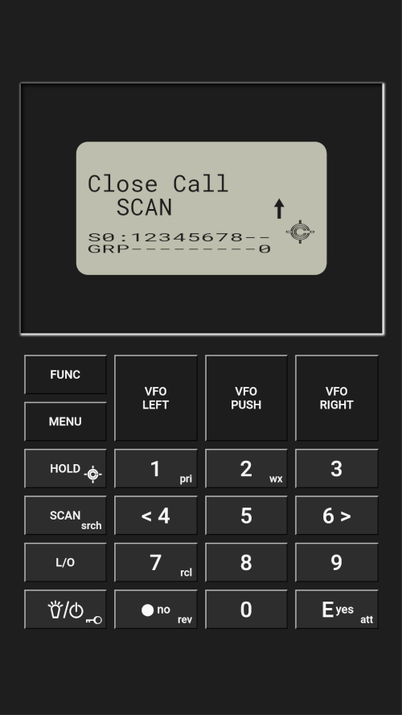

# BCD386T

## Screenshot

## Controls

You can control your scanner by clicking buttons, or by using keyboard shorcuts.

Here's the list of keyboard shorcuts (BCD4336HP):

|       |       |       |       |
| :---: | :---: | :---: | :---: |
| FUNC (**F**) | VFO LEFT | VFO PUSH | VFO RIGHT|
| MENU (**M**) | (**Left arrow**) | (**Space**) | (**Right arrow**) |
| HOLD/CC (**H**) | 1/PRI (**1**) | 2/WX (**2**) | 3 (**3**) |
| SCAN/SRCH (**S**) | < 4 (**4**) | 5 (**5**) | 6 > (**6**) |
| L/O (**L**) | 7/RCL (**7**) | 8 (**8**) | 9 (**9**) |
| LIGHT/POWER/LOCK (**P**) | ./NO/REV (**.**) | 0 (**0**) | E/YES/ATT (**Enter**) |

You can also **toggle fullscreen** display by either double clicking/taping on the display area, or either by pressing the **Tab key**.